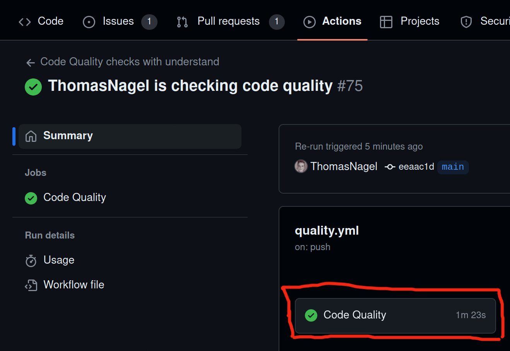
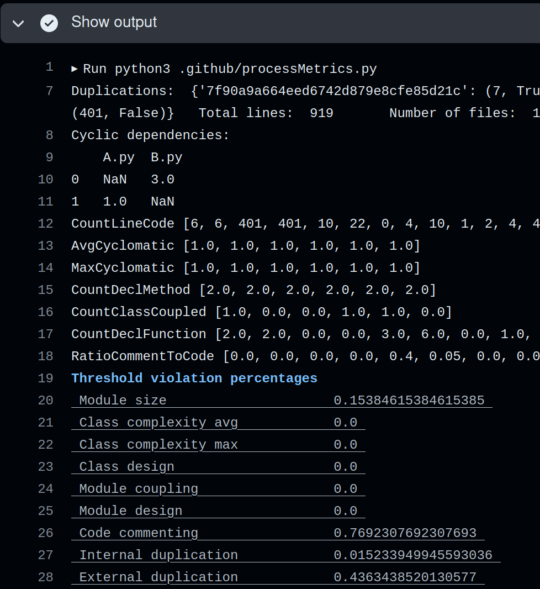

# BenchLab Website

## Installation & Development

### Prerequisites
1. Clone the repository.
2. Open the website folder.
3. Create a `.env` file in the website folder.
4. Add the following environment variables to the `.env` file:
``` properties
## Azure Blob Storage

AZURE_STORAGE_CONNECTION_STRING = 'connection_string'
AZURE_STORAGE_CONTAINER_SUBMISSION = 'container_name'

## Backend 
SECRET_KEY = "secret_key"
DB_NAME = "benchlab"
DB_HOST = "localhost"
DB_USER = "benchlabuser"
DB_PASSWORD = "password"

DEBUG = "True"

EMAIL_BACKEND = "django.core.mail.backends.smtp.EmailBackend"
EMAIL_HOST = "mail.tptech.nl"
EMAIL_FROM = "benchlab@tptech.nl"
EMAIL_HOST_USER = "benchlab@tptech.nl"
EMAIL_HOST_PASSWORD = "password"
EMAIL_PORT = "587"
EMAIL_USE_TLS = "True"

FRONTEND_URL = "http://localhost:5173/"

## Frontend 
VITE_API_URL = "http://localhost:8000/api"
```
For the value of `EMAIL_HOST_PASSWORD`, ask someone who set up the repository already.

### Frontend
1. Make sure you have **Node.js 20 LTS** installed on your machine. If not, please install it. **LINUX ONLY**: You might need to use Node Version Manager (nvm) to install this specific version of Node.js, as the default install command via `apt` has an older version.
2. Install/Activate yarn (run `corepack enable`, this command might require admin priviliges).
3. Open the frontend folder.
4. Run `yarn` (this will install all dependencies). **DO NOT USE NPM TO INSTALL DEPENDENCIES**.
5. To start vite you can run `yarn vite`.

### MySQL
1. Install MySQL.
2. Create a basic server.
3. Open the created database and run `CREATE DATABASE benchlab;` (using `sudo mysql` on Linux).
4. The run `CREATE USER 'benchlabuser'@'localhost' IDENTIFIED WITH mysql_native_password BY 'password';`.
5. Finally run `GRANT ALL PRIVILEGES ON benchlab.* TO 'benchlabuser'@'localhost';`.
6. Adjust the .env file based on the properties defined above, in case you modified any values (e.g. the password).

### Backend
1. Make sure you have **Python 3.12** installed. On Linux, this can be done with `sudo add-apt-repository ppa:deadsnakes/ppa`, followed by `sudo apt install python3.12 python3.12-venv python3.12-dev` (since you also need venv and the Python development headers).
2. On Linux, you also need the following: `sudo apt install pkg-config default-libmysqlclient-dev build-essential` (used by mysqlclient).
3. Create a virtual environment by running `python -m venv .venv` in the website(root) directory.
4. Select the virtual environment as your VS Code interpreter.
5. Activate the virtual environment by running (Linux) `source .venv/bin/activate` or (Windows) `.venv\Scripts\activate.bat`.
6. Navigate your command line into the backend folder (e.g. using `cd backend`).
6. Run pip install -r requirements.txt (this will install all dependencies).
7. Install the Ruff VSCode extension.
8. Run migrations: `python manage.py makemigrations` and `python manage.py migrate`.
9. Run seeder: `python manage.py loaddata XXXX_filename.json` where `XXXX_filename.json` is the file with the highest number in `backend/api/fixtures`.
10. To start the server, use `python manage.py runserver`.

### Folder Structure
After following the steps above, the folder structure should look like this:

```
website/
├─ .github/
├─ .venv/
├─ backend/
├─ docs/
├─ frontend/
├─ .env
├─ .gitignore
├─ README.md
├─ ruff.toml
├─ SECURITY.md
```

## Deployment

Use the production branch to deploy the webapp.

## Database seeding

To get initial data in the database run `python manage.py loaddata XXXX_filename.json`.
To remove all data from the database run `python manage.py flush` this will permanently delete all data from the database so be carefull with this.
Note: the passwords for the currently seeded accounts are `admin`, `staff` and `user` respectively

### Making new seeder files

A convenient way to make new seeder files is by creating new entries in the tables via the django admin panel (`localhost:8000/admin`) and then running the following command: `python manage.py dumpdata api --indent 4 --output=api/fixtures/XXXX_filename.json`. Here count up from previous highest number in the folder and maybe give the new file a somewhat descriptive name.

You can also choose to write your own seeder files from scratch with json but that can be a bit of a hassle because you have to manually do all the foreign keys.

### Workflow for when you alter models (no important data in the db)

NOTE: this is not yet a very streamlined workflow so if you find out stuff doesn't work or if you find a better way, please edit the file and make a pull request for it.
When doing migrations, sometimes it's not necessary to change all the data, in those cases make a new fixture file after migrating so that the changes are reflected in the seeded data.
If you do need to change data this can be a workflow:

- run `python manage.py makemigrations` to generate the migration files.
- run `python manage.py migrate` to migrate the changes.
- adapt the seeder files to reflect the new changes in the db.
- run `python manage.py flush` to empty the database.
- run `python manage.py loaddata XXXX_filename.json` to seed the db with the new data.

If the migrate command gives an error, it might be easier to reset your entire database. This can be done with `python manage.py reset_db`, rather than the flush command.

## Ruff

Ruff is a tool that checks, based on some rules, the Python code, similar to Java Checkstyle.

To change the settings or add features to ruff check the `ruff.toml` file. This can be found in the `backend` folder. This file also contains explanations for each setting/rule.

The following keybinds might be different on your machine:

Pressing <kbd>Shift</kbd> + <kbd>Alt</kbd> + <kbd>F</kbd> will allow you to use Ruff to format and fix the code. Keep in mind that Ruff is not able to fix all issues.

Pressing <kbd>Shift</kbd> + <kbd>Alt</kbd> + <kbd>O</kbd> will use isort to sort the imports. 

## Code quality analysis

### What to do if checks fail?

Navigate to *show output* as shown below in the **Usage** section.
If *show output* in the workflow failed and it states **Code violations found!!!!!** at the bottom then you're code does not adhere to the quality standards. The table in the output above shows which categories have violations (in red). For a better understanding of quality standards you can look at the tables in the **Metrics** section.

For any questions about this workflow or issues contact Tom.

### Usage

This worklfow is run whenever a commit is pushed to main or a pr into main is made. It may take between 1 to 3 minutes to complete the analysis. To view the results do the following:

Navigate to the github action and click on the job *Code Quality*:\


The *Show output* tab shows all the metrics gathered by the tools:\


The output starts with some intermediate debug results, which you can ignore.
The evaluation of you code is shown in the tables below. *Threshold violation percentages* is the percentage of files/code that violate the metrics shown in the table below. *Ranks* shows the combined rank for each maintainability attribute. It shows the grade that our code would get according to the metrics that the TU/e uses.


### Metrics

For each characteristic we compute what percentage of the code is above the threshold. Then a rank is computed for that characteristic. For each Maintainability attribute we compute the average rank (based on its corresponding code characteristics).

Code characteristic         | Metric                               | Threshold | Maintainability attr.
----------------------------|--------------------------------------|-----------|----------------------
Module size                 | SLOC                                 |  <=400    | ADT
Class complexity            | Cyclomatic per method: average; max  |  <10; <20 | DT
Class design (for OO)       | WMC                                  |  <=20     | MRAD
Module design (for non OO)  | Functions per module/file            |  <=20     | MRAD
Module internal duplication | % of duplicated SLOC inside modules  |  N/A      | RAD
Code commenting             | % LOCM                               |  >15%     | A
Cyclic dependencies         | # of between classes                 |  0        | MRADT
Module coupling             | CBO                                  |  <16      | MR
Module external duplication | % of duplicated SLOC between modules |  N/A      | MR

rank    |    % of modules/classes/packages above threshold
--------|-------------------------------------------------
+2      |    0-3%
+1      |    4-5%
0       |    6-10%
-1      |    11-20%
-2      |    21–100%

Code | Maintainability attribute
-----|--------------------------
M    | Modularity
R    | Reusability
A    | Analyzability
D    | Modifiability
T    | Testability

The code quality assessment document that TU/e uses can be found [here](https://canvas.tue.nl/courses/25283/files/folder/SEP%20Materials/Assessment%20and%20Guidelines?).


### Code analysis tools
TU/e uses [simian](http://www.harukizaemon.com/simian/index.html/) to analyse code duplication.
[understand](http://scitools.com/student) is used to derive all the other metrics.

**Note:** understand incorrectly computes Module coupling, it only accounts for classes in the same file. 

### Testing

In order to test, navigate to the backend folder, then run the following command:
`python manage.py test tests`